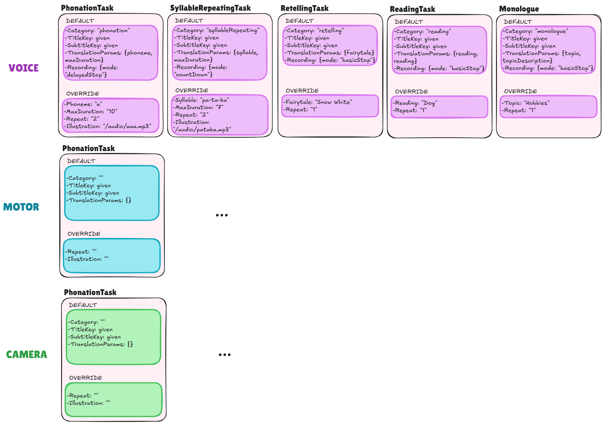

# 🎙️ React Voice Recorder & Admin Task Editor

A modular, multilingual **React platform for standardized voice and cognitive tasks**.
Built around a Voice Recorder, Admin Task Editor, and a configurable task system — designed to support standardized testing, flexible protocols, and multilingual deployment.


## Overview

This is more than a voice recorder — it’s a full **framework for guided recording tasks**, with dynamic parameters, translations, and standardized workflows.

It consists of two main parts (interfaces):

| Component                | Description                                                                                                                                    |
| -------------------------| ---------------------------------------------------------------------------------------------------------------------------------------------- |
| 🎧 **Voice Recorder**    | User-facing module for performing guided recording tasks with dynamic instructions and translations.                                           |
| 🧑‍💼 **Admin Task Editor** | Interface for researchers or clinicians to modify or design task protocols — defining task order, repetitions, parameters, and allowed values. |

## Goal of the System
To build a standardized and shareable protocol system that is:
- **Consistent**: standardized task wording across studies and languages.
- **Flexible**: admins can change only task parameters (e.g., topic, phoneme, duration) — not the structure or core instructions.
- **Reusable**: protocols can be shared across sessions, languages, and research groups.
- **Transparent**: configuration-driven, type-safe, and easy to maintain.

## ⚙️ Quick Start
```bash
git clone https://github.com/maskopav/web_app_test_react.git 
npm install
npm run dev
# or
npm run dev -- --host # To run the app with network acess
```
Open `http://localhost:5173` in your browser, or use the Network URL (e.g. `http://192.168.87.184:5173/`) shown in your terminal to test on nobile (same Wi-Fi required).


## Task Definition 
Tasks are defined in **two files only**:
| File                         | Purpose                                                                                    |
| ---------------------------- | ------------------------------------------------------------------------------------------ |
| `src/config/taskBase.ts`     | Defines all technical parameters, modes, and defaults (used by logic and Admin UI).        |
| `src/i18n/[lang]/tasks.json` | Defines user-facing text — names, instructions, labels, and parameter values.              |

### Adding a New Task
When adding a new task, you must update both files:

 1. src/config/taskBase.ts – Technical Configuration
Example:
```json
export const taskBaseConfig = {
  ...: {
    .....
  },
  monologue: {
    type: "voice",
    recording: { mode: "basicStop" },
    params: {
      topic: { default: "any" },
      repeat: { default: 1 }
    }
  }
};
```
💡 Note: `duration` is only required when the recording.mode is `countDown` or `delayedStop`.
All parameters editable by the admins in Admin interface **need** to appear in params.

2. src/i18n/[lang]/tasks.json – Translations and Labels
Example:
```json
{
  "monologue": {
    "name": "Monologue on topic",
    "title": "Monologue on: {{topic}}",
    "instructions": "Press START and talk about {{topicDescription}} until the timer runs out.",
    "params": {
      "topic": {
        "label": "Monologue topic",
        "values": {
          "any": {
            "label": "Any topic",
            "topicDescription": "anything that comes to your mind"
          },
          "hobbies": {
            "label": "Hobbies",
            "topicDescription": "hobbies (sport, music, reading, gardening, pets, etc.)"
          },
          "family": {
            "label": "Family",
            "topicDescription": "family"
          }
        }
      },
      "repeat": {
        "label": "Repetitions"
      }
    }
  }
}
```
💡 Note: See next chapter for explanation to dynamic parameters `{{ }}`..

### Dynamic Translations and Recursive Parameters
Parameters wrapped in `{{ }}` are automatically resolved and replaced with translated values.
The helper `getResolvedParams()` (in `translations.ts`) recursively traverses all nested structures to extract:
  - Labels (`label`)
  - Custom text fields (`topicDescription`, etc.)

Example:
```js
createTask("monologue", { topic: "any" });
```
Resolves to:
```js
{
  topic: "Any topic",
  topicDescription: "anything that comes to your mind",
  repeat: 1
}
```
Then used dynamically in:
```json
"title": "Monologue on: {{topic}}"
"instructions": "Press START and talk about {{topicDescription}}"
```

## Task Factory

All tasks are created through a single factory
Example:
```js
export const TASKS = [
  createTask("phonation", { phoneme: "a", duration: 3 }),
  createTask("retelling", { fairytale: "snowWhite" }),
  createTask("reading", { topic: "seedling" }),
  createTask("monologue", { topic: "any" })
];
```

Each task will:
1. Pull default behavior from `taskBase.ts`
2. Merge parameter overrides
3. Applies localized labels and resolved parameters

## Available Task Parameters
TODO:
👉 See the diagrams for a full overview:

Diagram 1 – Task Structure: relationship between BaseTask, TaskType, TaskCategory, and RecordingMode.

Diagram 2 – Task Parameters: concrete overridable arguments for each task type.


To keep the protocol standardized yet flexible, only selected parameters are meant to be editable by admins.
| Key              | Description                              | Editable by Admin  | Supports `{{ }}` placeholders |
| ---------------- | ---------------------------------------- | ------------------ | ----------------------------- |
| `title`          | Displayed before recording starts        | ❌ (standardized)   | ✅                             |
| `instructions`   | Instructions before recording            | ❌ (standardized)   | ✅                             |
| `instructionsActive` | Instructions during recording        | ❌ (standardized)   | ✅                             |
| `repeat`         | Number of repetitions                    | ✅                  | ❌                             |
| `duration`       | Recording duration limit                 | ✅                  | ❌                             |
| `phoneme`        | Phonation target (e.g., “a”, “i”)        | ✅                  | ✅                             |
| `syllable`       | Repetition target for articulatory tasks | ✅                  | ✅                             |
| `topic`          | Monologue/reading topic                  | ✅                  | ✅                             |
| `fairytale`      | Story to retell                          | ✅                  | ✅                             |
| `text`           | Reading material reference               | ✅                  | ✅                             |
| `recording.mode` | Recording mode type                      | ❌ (fixed per task) | ❌                             |

🟢 Rule:
Admins can adjust task content (topics, phonemes, durations),
but not task instructions (titles and instructions remain standardized).

#### RecordingMode variants:
- `{ mode: "basicStop" }` → manual stop
- `{ mode: "countDown", duration: number }` → countdown timer, stops automatically
- `{ mode: "delayedStop", duration: number }` → stop button appears after time of duration runs out, then manual stop

## Internationalization (i18n)
This project uses *react-i18next* to support multiple languages.
Translations are stored in `src/i18n/` in per-language folders:
```bash
src/
├── i18n/
│ |── en
│ | ├── common.json       # shared buttons, status, general UI
│ | ├── tasks.json        # user-facing labels for tasks (title,  instructions), names & descriptions of parameters, possible values
│ | ├── admin.json        # AdminTaskEditor & modal texts
│ | └── recorder.json     # labels & states for recording UI
│ |── cs
│ |── de
│ |── # add a new language folder with the same components and keys as in other language files (copy paste the whole ofolder and rewrite it)
| └── index.js  # i18n setup
```
### Adding a New Language
1. Copy an existing folder (e.g. `en` → `fr`)
2. Translate the values in all files, keeping keys identical
3. Register the language in `src/i18n/index.js`

## Project Architecture & File Structure
Main architecture:
| Layer                       | Purpose                                                       |
| --------------------------- | ------------------------------------------------------------- |
| `VoiceRecorder`             | Recording logic and UI for users                              |
| `AdminTaskEditor`           | Interface for creating/modifying task protocols               |
| `config/taskBase.ts`        | Typed task definitions (technical behavior, defaults, params) |
| `i18n/[lang]/tasks.json`    | Defines translated titles,  instructionss, and parameter labels    |
| `utils/translation.ts`      | Recursively resolves parameters and translations              |
| `tasks.ts`                  | Factory combining base + translations into runtime task definitions  |
| `App.jsx`                   | Manages the execution flow and mode switching (Admin ↔️ User) |

The project follows a **Container / Presentation pattern**, separating **logic** from **UI components**.  
Below is the file structure with inline notes describing each file’s role:
```bash
src/
├── components/
│ |── VoiceRecorder/           # UI layer for recording feature
│ | ├── VoiceRecorder.jsx      # Container: wires hook state/actions to subcomponents
│ | ├── VoiceRecorder.css      # Scoped styles for VoiceRecorder
│ | ├── AudioExampleButton.jsx # Button for playing example audio clip (if defined in task)
│ | ├── AudioVisualizer.jsx    # Renders real-time animated bars from audio levels
│ | ├── NextTaskButton.jsx     # Navigation button to move to the next task
│ | ├── PlaybackSection.jsx    # Playback UI + Save / Reset controls
│ | ├── RecordingControls.jsx  # Start / Pause / Resume / Stop buttons
│ | ├── RecordingTimer.jsx     # Displays elapsed time + contains AudioVisualizer
│ | ├── StatusIndicator.jsx    # Shows current state (Idle, Recording, Paused, etc.)
│ | └── index.js               # Barrel file for clean imports
│ │
│ ├── AdminTaskEditor/
│ │ ├── AdminTaskEditor.jsx    # main container component
│ │ ├── Modal.jsx              # reusable modal component
│ │ ├── index.js               # barrel export
│ │ ├── AdminTaskEditor.css    # scoped styles
│ │ └── helpers.js             # small helpers like collectInputPaths
│ │
│ |── ModeSwitchButton.jsx     # 
│ └── CompletionScreen.jsx     # Dedicated UI for final screen
│
├── hooks/
│ └── useVoiceRecorder.js    # Logic layer: manages state, MediaRecorder, AudioContext
│                            # Exposes API: startRecording, pauseRecording, resumeRecording, stopRecording, resetRecording
├── config/
│ └── taskBase.ts            # Typed task definitions (modes, durations, params)   
│
├── utils/
│ └── translation.ts         # Translation function, auto-extract possible values
│
├── i18n/                    # Multilingual configuration (see in Internationalization chapter)
│
├── tasks.ts                 # Task creation factory (no editing needed)
├── App.jsx                  # Orchestrates main flow
├── App.css                  # Global styles
└── main.jsx                 # App bootstrap (ReactDOM + i18n import)
```

### Design principles
- Typed taskBase.ts → type safety when defining new tasks
- Translation-driven parameters → single source of truth for values
- No redundancy → developers define parameters once (in translations)
- Separation of concerns → config defines behavior, translations define UI text
- Reproducibility → standardized task instructions, flexible parameters

### Styling
- **Global styles**: `App.css`
- **Component-specific styles**: colocated `.css` files inside each folder

## Installation & Usage

1. Install dependencies (React project setup assumed):
```bash
npm install
# or
yarn install
```
2. Start the server (LAN-enabled):
```bash
npm start
# or
npm run dev # For auto-reload during development (server restarts on file changes)
```
3. The terminal will display two URLs, e.g.:
   - Local: `http://localhost:3000`
   - Network: `http://192.168.1.25:3000`

Open the Network URL on your phone (connected to the same Wi‑Fi) to test on mobile. If it doesn't load:
- Ensure your phone and PC are on the same network
- Temporarily allow Node.js through Windows Defender Firewall
- Avoid corporate/VPN networks that isolate devices


## Deployment (running on the server)
- 1. Build the app -> static files are generated inside the folder `dist` using command:
```bash
npm run build
```
- 2. Upload `dist` folder to your web server (e.g. filemanager server).
- 3. Access via: `https://yourdomain.com/path/to/dist/` (e.g. `https://malenia.feld.cvut.cz/test/dist/`)


