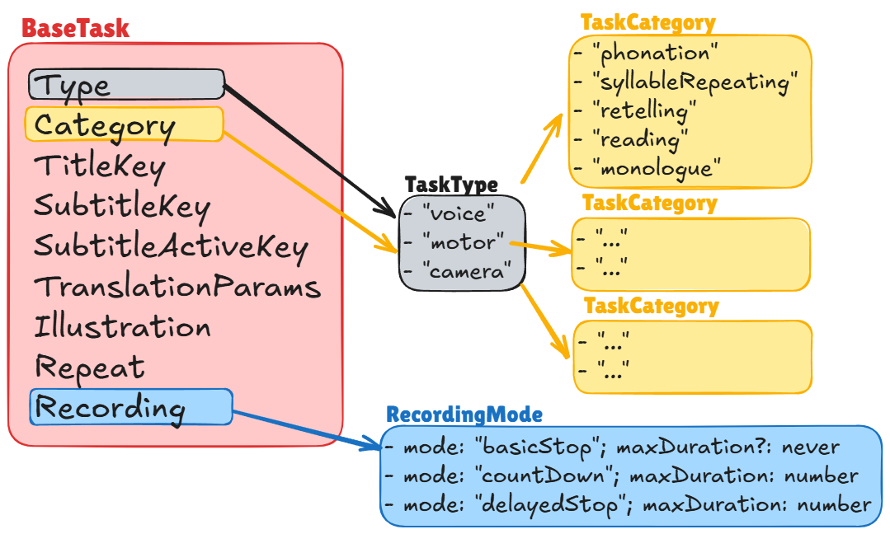

# 🎙️ React Voice Recorder & Admin Task Editor

A modular, multilingual **React platform for standardized voice and cognitive tasks**.
Built around a Voice Recorder, Admin Task Editor, and a configurable task system — designed to support standardized testing, flexible protocols, and multilingual deployment.


## Overview

This project is not only a voice recording component, but a complete **interactive framework** for defining and running guided recording tasks.

It consists of two main parts:

| Component                   | Description                                                                                                                                    |
| --------------------------- | ---------------------------------------------------------------------------------------------------------------------------------------------- |
| 🎧 **Voice Recorder**       | User-facing module for performing guided recording tasks with dynamic instructions and translations.                                           |
| 🧑‍💼 **Admin Task Editor** | Interface for researchers or clinicians to modify or design task protocols — defining task order, repetitions, parameters, and allowed values. |


The long-term goal is to build a **standardized protocol system**, where:
- Task instructions (titles, subtitles) remain consistent and standardized.
- Admins can customize only specific parameters (like the topic for monologue or the phoneme for phonation).
- Protocols can be easily saved, shared, and reused for different studies or sessions.

## Quick Start
```bash
git clone https://github.com/yourusername/react-voice-recorder.git
cd react-voice-recorder
npm install
npm run dev
# or
npm run dev -- --host # To run the app with network acess
```
Open `http://localhost:5173` in your browser, or use the Network URL (e.g. `http://192.168.87.184:5173/`) shown in your terminal to test on nobile (same Wi-Fi required).

## Architecture Overview
| Layer                       | Purpose                                                       |
| --------------------------- | ------------------------------------------------------------- |
| `VoiceRecorder`             | Recording logic and UI for users                              |
| `AdminTaskEditor`           | Interface for creating/modifying task protocols               |
| `taskBase.json`             | Defines technical defaults and allowed parameters             |
| `tasks.json` (per language) | Defines translated titles, subtitles, labels                  |
| `translations.ts`           | Recursively resolves parameters and translations              |
| `tasks.ts`                  | Combines all into ready-to-run task definitions               |
| `App.jsx`                   | Manages the execution flow and mode switching (Admin ↔️ User) |


## Task Definition Overview
Tasks are defined in two files:
| File                         | Purpose                                                                                    |
| ---------------------------- | ------------------------------------------------------------------------------------------ |
| `src/config/taskBase.json`   | Defines all technical parameters and default values (used by Admin interface).             |
| `src/i18n/[lang]/tasks.json` | Defines user-facing names, titles, subtitles, and localized parameter labels/descriptions. |

🟢 When adding a new task, you must update both files.

### 1. src/config/taskBase.json – Technical Configuration

This file defines **how the task behaves**:
recording mode, default parameter values, maximum duration, and other settings. (used by AdminTaskEditor)

Example:
```json
{
  "monologue": {
    "type": "voice",
    "recording": { "mode": "basicStop" },
    "params": {
      "topic": { "default": "any" },
      "repeat": { "default": 1 }
    }
  }
}
```
### 2. src/i18n/en/tasks.json – Translations and Labels

This file defines **how the task appears to the user**.
It includes titles, subtitles, and parameter descriptions in the selected language.

Example:
```json
{
  "monologue": {
    "name": "Monologue on topic",
    "title": "Monologue on: {{topic}}",
    "subtitle": "Press START and talk about {{topicDescription}} until the timer runs out.",
    "params": {
      "topic": {
        "label": "Monologue topic",
        "values": {
          "any": {
            "label": "Any topic",
            "topicDescription": "anything that comes to your mind"
          },
          "hobbies": {
            "label": "Hobbies",
            "topicDescription": "hobbies (sport, music, reading, gardening, pets, etc.)"
          },
          "family": {
            "label": "Family",
            "topicDescription": "family"
          }
        }
      },
      "repeat": {
        "label": "Repetitions"
      }
    }
  }
}
```

The logic will:
- Insert any parameter wrapped in {{ }} (e.g. {{topic}}, {{topicDescription}})
- Recursively flatten nested parameters, so "any" returns:
```js
{ 
  topic: "Any topic", 
  topicDescription: "anything that comes to your mind",
  repeat: 1
}
```

## Dynamic Translations and Recursive Parameters
- Parameters wrapped in {{ }} (e.g. {{topic}}) are automatically replaced using the current task’s parameters.
- The function getResolvedParams() (in translations.ts) recursively explores nested parameter structures to resolve:
  - label
  - description
  - or any other custom keys (topicDescription, phonemeLabel, etc.)
- The result is a fully flattened object ready for dynamic insertion into titles and subtitles.

Example:
```js
createTask("monologue", { topic: "any" });
```

Resolves to:
```js
{
  topic: "Any topic",
  topicDescription: "anything that comes to your mind",
  repeat: 1
}
```
Then used in translation:
```json
"title": "Monologue on: {{topic}}"
"subtitle": "Press START and talk about {{topicDescription}}"
```

## Task Logic

Tasks are created using a factory pattern via src/tasks.ts.
Factories automatically apply defaults and recording modes, and merge with translated parameters.

Example:
```js
export const TASKS = [
  createTask("phonation", { phoneme: "a", maxDuration: 3 }),
  createTask("retelling", { fairytale: "snowWhite" }),
  createTask("reading", { topic: "seedling" }),
  createTask("monologue", { topic: "any" })
];
```

Each task will:
1. Pull default behavior from taskBase.json
2. Merge overrides (e.g. maxDuration: 3)
3. Load localized labels/descriptions from tasks.json

## Available Task Parameters
TODO:
👉 See the diagrams for a full overview:

Diagram 1 – Task Structure: relationship between BaseTask, TaskType, TaskCategory, and RecordingMode.

Diagram 2 – Task Parameters: concrete overridable arguments for each task type.


To keep the protocol standardized yet flexible, only selected parameters are meant to be editable by admins.
| Key              | Description                              | Editable by Admin  | Supports `{{ }}` placeholders |
| ---------------- | ---------------------------------------- | ------------------ | ----------------------------- |
| `title`          | Displayed before recording starts        | ❌ (standardized)   | ✅                             |
| `subtitle`       | Instruction text before recording        | ❌ (standardized)   | ✅                             |
| `subtitleActive` | Instruction during recording             | ❌ (standardized)   | ✅                             |
| `repeat`         | Number of repetitions                    | ✅                  | ❌                             |
| `maxDuration`    | Recording duration limit                 | ✅                  | ❌                             |
| `phoneme`        | Phonation target (e.g., “a”, “i”)        | ✅                  | ✅                             |
| `syllable`       | Repetition target for articulatory tasks | ✅                  | ✅                             |
| `topic`          | Monologue/reading topic                  | ✅                  | ✅                             |
| `fairytale`      | Story to retell                          | ✅                  | ✅                             |
| `text`           | Reading material reference               | ✅                  | ✅                             |
| `recording.mode` | Recording mode type                      | ❌ (fixed per task) | ❌                             |

🟢 Rule of thumb:
Admins can adjust task content (topics, phonemes, durations),
but not task instructions (titles and subtitles remain standardized).

### RecordingMode variants:
- { mode: "basicStop" } → manual start/stop
- { mode: "countDown", maxDuration: number } → countdown timer, stops automatically
- { mode: "delayedStop", maxDuration: number } → starts immediately, auto-stops after duration

## Internationalization (i18n)
This project uses react-i18next to support multiple languages.
Translations are stored in `src/i18n/` in per-language folders:
```bash
src/
├── i18n/
│ |── en
│ | ├── common.json       # shared buttons, status, general UI
│ | ├── tasks.json        # user-facing labels for tasks (title, subtitle), names & descriptions of parameters, possible values
│ | ├── admin.json        # AdminTaskEditor & modal texts
│ | └── recorder.json     # labels & states for recording UI
│ |── cs
│ |── de
│ |── # add a new language folder with the same components and keys as in other language files (copy paste the whole ofolder and rewrite it)
| └── index.js  # i18n setup
```
### Adding a New Language
1. Copy an existing folder (e.g. `en`) → `fr`
2. Translate the values in all files, keeping keys identical
3. Register the language in `src/i18n/index.js`

## Project Architecture & File Structure
The project follows a **Container / Presentation pattern**, separating **logic** from **UI components**.  
Below is the file structure with inline notes describing each file’s role:
```bash
src/
├── components/
│ |── VoiceRecorder/           # UI layer for recording feature
│ | ├── VoiceRecorder.jsx      # Container: wires hook state/actions to subcomponents
│ | ├── VoiceRecorder.css      # Scoped styles for VoiceRecorder
│ | ├── AudioExampleButton.jsx # Button for playing example audio clip (if defined in task)
│ | ├── AudioVisualizer.jsx    # Renders real-time animated bars from audio levels
│ | ├── NextTaskButton.jsx     # Navigation button to move to the next task
│ | ├── PlaybackSection.jsx    # Playback UI + Save / Reset controls
│ | ├── RecordingControls.jsx  # Start / Pause / Resume / Stop buttons
│ | ├── RecordingTimer.jsx     # Displays elapsed time + contains AudioVisualizer
│ | ├── StatusIndicator.jsx    # Shows current state (Idle, Recording, Paused, etc.)
│ | └── index.js               # Barrel file for clean imports
│ │
│ ├── AdminTaskEditor/
│ │ ├── AdminTaskEditor.jsx    # main container component
│ │ ├── Modal.jsx              # reusable modal component
│ │ ├── index.js               # barrel export
│ │ ├── AdminTaskEditor.css    # scoped styles
│ │ └── helpers.js             # small helpers like collectInputPaths
│ │
│ |── ModeSwitchButton.jsx     # 
│ └── CompletionScreen.jsx     # Dedicated UI for final screen
│
├── hooks/
│ └── useVoiceRecorder.js    # Logic layer: manages state, MediaRecorder, AudioContext
│                            # Exposes API: startRecording, pauseRecording, resumeRecording, stopRecording, resetRecording
├── utils/
│ └── translation.ts         # Translation function 
│
├── i18n/                    # Internationalization setup
│ ├── en/                    # English translations folder
│ ├── cs/                    # Czech translations folder
│ └── index.js               # i18n configuration (react-i18next setup)
│
├── tasks.ts                 # All task definitions in one place
├── App.jsx                  # Orchestrates main flow
├── App.css                  # Global styles
└── main.jsx                 # App bootstrap (ReactDOM + i18n import)
```

### Summary
- **Logic lives in `hooks/useVoiceRecorder.js`**: manages browser APIs, timers, state, and cleanup.  
- **Presentation lives in `components/VoiceRecorder/`**: small, focused UI components that consume the hook.  
- **Tasks live in `App.jsx`**: configurable set of exercises with titles, subtitles, and audio examples.  
- **i18n lives in `src/i18n/`**: JSON files per language + `index.js` setup with `react-i18next`.  
| Layer                 | Purpose                                                   |
| --------------------- | --------------------------------------------------------- |
| `taskBase.json`       | Technical definitions (modes, durations, params)          |
| `tasks.json`          | Translated names, subtitles, labels, and dynamic text     |
| `translations.ts`     | Recursive resolver — merges technical + translated params |
| `tasks.ts`            | Combines both into runtime tasks for React app            |
| `useVoiceRecorder.js` | Controls actual recording behavior                        |
| `App.jsx`             | Manages task sequence and user flow                       |


### Styling
- **Global styles**: `App.css`
- **Component-specific styles**: colocated `.css` files inside each folder


## Goal of the System

This project is designed to:
- **Standardize** task definitions and user instructions
- **Centralize** all translations and behaviors in configuration
- **Enable reproducibility** and **cross-language consistency**
- **Empower admins** to design new protocols via the UI —
without breaking task structure or standard wording

Ultimately, the goal is a **configurable, multilingual testing platform**
for speech and cognitive tasks — flexible for researchers, consistent for users.

## Installation & Usage

1. Install dependencies (React project setup assumed):
```bash
npm install
# or
yarn install
```
2. Start the server (LAN-enabled):
```bash
npm start
# or
npm run dev # For auto-reload during development (server restarts on file changes)
```
3. The terminal will display two URLs, e.g.:
   - Local: `http://localhost:3000`
   - Network: `http://192.168.1.25:3000`

Open the Network URL on your phone (connected to the same Wi‑Fi) to test on mobile. If it doesn't load:
- Ensure your phone and PC are on the same network
- Temporarily allow Node.js through Windows Defender Firewall
- Avoid corporate/VPN networks that isolate devices


## Deployment (running on the server)
- App needs to be build at first -> static files are generated inside the folder `dist` using command `npm run build`
- Upload `dist` folder to the filemanager server
- Open `https://malenia.feld.cvut.cz/test/dist/`


