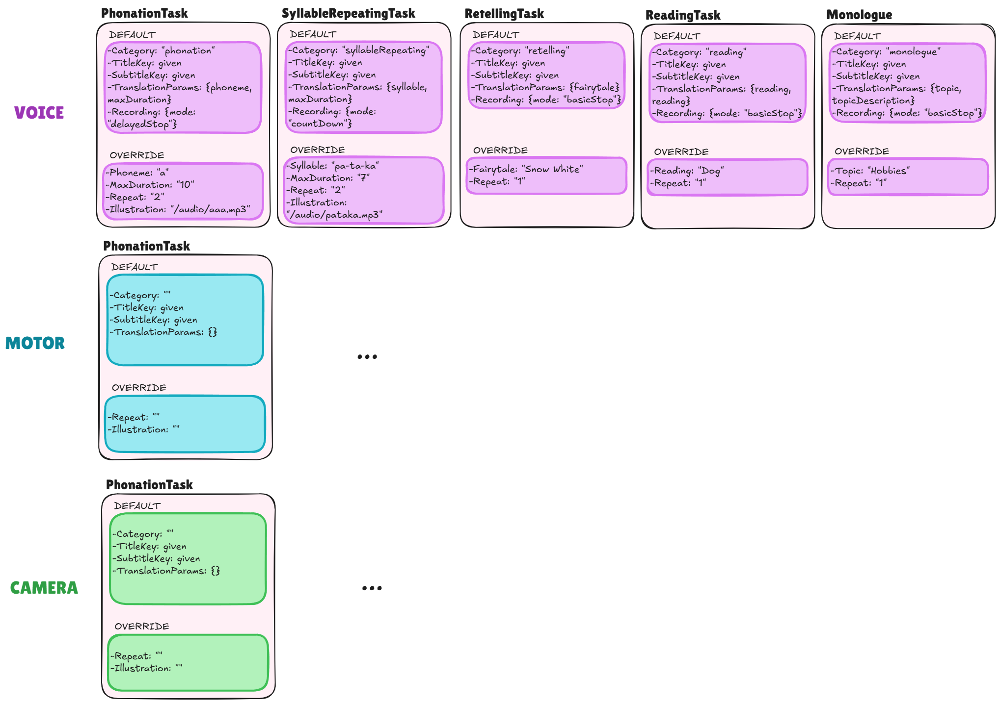

# Frontend - TaskProtocoller Web App

A modular, multilingual **React platform for standardized voice and cognitive tasks**.
Built around a Voice Recorder, Admin Task Editor, and a configurable task system — designed to support standardized testing, flexible protocols, and multilingual deployment.


## Overview

This is more than a voice recorder — it’s a full **framework for guided recording tasks**, with dynamic parameters, translations, and standardized workflows.

It consists of two main parts (interfaces):

| Component                | Description                                                                                                                                    |
| -------------------------| ---------------------------------------------------------------------------------------------------------------------------------------------- |
| 🎧 **Voice Recorder**    | User-facing module for performing guided recording tasks with dynamic instructions and translations.                                           |
| 🧑‍💼 **Admin Task Editor** | Interface for researchers or clinicians to modify or design task protocols — defining task order, repetitions, parameters, and allowed values. |

## Goal of the System
To build a standardized and shareable protocol system that is:
- **Consistent**: standardized task wording across studies and languages.
- **Flexible**: admins can change only task parameters (e.g., topic, phoneme, duration) — not the structure or core instructions.
- **Reusable**: protocols can be shared across sessions, languages, and research groups.
- **Transparent**: configuration-driven, type-safe, and easy to maintain.

## ⚙️ Quick Start
```bash
git clone https://github.com/maskopav/web_app_test_react.git 
npm install
npm run dev
# or
npm run dev -- --host # To run the app with network acess
```
Open `http://localhost:5173` in your browser, or use the Network URL (e.g. `http://192.168.87.184:5173/`) shown in your terminal to test on nobile (same Wi-Fi required).


## Task Definition 
Tasks are defined in **two files only**:
| File                         | Purpose                                                                                    |
| ---------------------------- | ------------------------------------------------------------------------------------------ |
| `src/config/taskBase.ts`     | Defines all technical parameters, modes, and defaults (used by logic and Admin UI).        |
| `src/i18n/[lang]/tasks.json` | Defines user-facing text — names, instructions, labels, and parameter values.              |

### Adding a New Task
When adding a new task, you must update both files:

 1. src/config/taskBase.ts – Technical Configuration
Example:
```json
export const taskBaseConfig = {
  ...: {
    .....
  },
  monologue: {
    type: "voice",
    recording: { mode: "basicStop" },
    params: {
      topic: { default: "any" },
      repeat: { default: 1 }
    }
  }
};
```
💡 Note: `duration` is only required when the recording.mode is `countDown` or `delayedStop`.
All parameters editable by the admins in Admin interface **need** to appear in params.

2. src/i18n/[lang]/tasks.json – Translations and Labels
Example:
```json
{
  "monologue": {
    "name": "Monologue on topic",
    "title": "Monologue on: {{topic}}",
    "instructions": "Press START and talk about {{topicDescription}} until the timer runs out.",
    "params": {
      "topic": {
        "label": "Monologue topic",
        "values": {
          "any": {
            "label": "Any topic",
            "topicDescription": "anything that comes to your mind"
          },
          "hobbies": {
            "label": "Hobbies",
            "topicDescription": "hobbies (sport, music, reading, gardening, pets, etc.)"
          },
          "family": {
            "label": "Family",
            "topicDescription": "family"
          }
        }
      },
      "repeat": {
        "label": "Repetitions"
      }
    }
  }
}
```
💡 Note: See next chapter for explanation to dynamic parameters `{{ }}`..

### Dynamic Translations and Recursive Parameters
Parameters wrapped in `{{ }}` are automatically resolved and replaced with translated values.
The helper `getResolvedParams()` (in `translations.ts`) recursively traverses all nested structures to extract:
  - Labels (`label`)
  - Custom text fields (`topicDescription`, etc.)

Example:
```js
createTask("monologue", { topic: "any" });
```
Resolves to:
```js
{
  topic: "Any topic",
  topicDescription: "anything that comes to your mind",
  repeat: 1
}
```
Then used dynamically in:
```json
"title": "Monologue on: {{topic}}"
"instructions": "Press START and talk about {{topicDescription}}"
```

## Task Factory

All tasks are created through a single factory - it is done automatically inside App.jsx
Example:
```js
export const TASKS = [
  createTask("phonation", { phoneme: "a", duration: 3 }),
  createTask("retelling", { fairytale: "snowWhite" }),
  createTask("reading", { topic: "seedling" }),
  createTask("monologue", { topic: "any" })
];
```

Each task will:
1. Pull default behavior from `taskBase.ts`
2. Merge parameter overrides
3. Applies localized labels and resolved parameters

## Available Task Parameters
TODO:
👉 See the diagrams for a full overview:

Diagram 1 – Task Structure: relationship between BaseTask, TaskType, TaskCategory, and RecordingMode.

Diagram 2 – Task Parameters: concrete overridable arguments for each task type.


To keep the protocol standardized yet flexible, only selected parameters are meant to be editable by admins.
| Key              | Description                              | Editable by Admin  | Supports `{{ }}` placeholders |
| ---------------- | ---------------------------------------- | ------------------ | ----------------------------- |
| `title`          | Displayed before recording starts        | ❌ (standardized)   | ✅                             |
| `instructions`   | Instructions before recording            | ❌ (standardized)   | ✅                             |
| `instructionsActive` | Instructions during recording        | ❌ (standardized)   | ✅                             |
| `repeat`         | Number of repetitions                    | ✅                  | ❌                             |
| `duration`       | Recording duration limit                 | ✅                  | ❌                             |
| `phoneme`        | Phonation target (e.g., “a”, “i”)        | ✅                  | ✅                             |
| `syllable`       | Repetition target for articulatory tasks | ✅                  | ✅                             |
| `topic`          | Monologue/reading topic                  | ✅                  | ✅                             |
| `fairytale`      | Story to retell                          | ✅                  | ✅                             |
| `text`           | Reading material reference               | ✅                  | ✅                             |
| `recording.mode` | Recording mode type                      | ❌ (fixed per task) | ❌                             |

🟢 Rule:
Admins can adjust task content (topics, phonemes, durations),
but not task instructions (titles and instructions remain standardized).

#### RecordingMode variants:
- `{ mode: "basicStop" }` → manual stop
- `{ mode: "countDown", duration: number }` → countdown timer, stops automatically
- `{ mode: "delayedStop", duration: number }` → stop button appears after time of duration runs out, then manual stop

## Internationalization (i18n)
This project uses *react-i18next* to support multiple languages.
Translations are stored in `src/i18n/` in per-language folders:
```bash
src/
├── i18n/
│ |── en
│ | ├── common.json       # shared buttons, status, general UI
│ | ├── tasks.json        # user-facing labels for tasks (title,  instructions), names & descriptions of parameters, possible values
│ | ├── admin.json        # AdminTaskEditor & modal texts
│ | └── recorder.json     # labels & states for recording UI
│ |── cs
│ |── de
│ |── # add a new language folder with the same components and keys as in other language files (copy paste the whole ofolder and rewrite it)
| └── index.js  # i18n setup
```
### Adding a New Language
1. Copy an existing folder (e.g. `en` → `fr`)
2. Translate the values in all files, keeping keys identical
3. Register the language in `src/i18n/index.js`

## Project Architecture & File Structure
Main architecture:
| Layer                       | Purpose                                                       |
| --------------------------- | ------------------------------------------------------------- |
| `VoiceRecorder`             | Recording logic and UI for users                              |
| `AdminTaskEditor`           | Interface for creating/modifying task protocols               |
| `config/taskBase.ts`        | Typed task definitions (technical behavior, defaults, params) |
| `i18n/[lang]/tasks.json`    | Defines translated titles,  instructionss, and parameter labels    |
| `utils/translation.ts`      | Recursively resolves parameters and translations              |
| `tasks.ts`                  | Factory combining base + translations into runtime task definitions  |
| `App.jsx`                   | Manages the execution flow and mode switching (Admin ↔️ User) |

| Folder            | Purpose                                                                 |
| ----------------- | ----------------------------------------------------------------------- |
| `src/api/`        | Contains all backend API calls (`mappings.js`, `protocols.js`)          |
| `src/components/` | Reusable UI components (AdminTaskEditor, modals, etc.)                  |
| `src/hooks/`      | Custom hooks for logic and data management (e.g., `useProtocolManager`) |
| `src/context/`    | (Optional) Global state providers like `MappingContext`                 |
| `src/config/`     | Static configuration (e.g., base task definitions)                      |
| `src/utils/`      | Helper functions and translations                                       |


The project follows a **Container / Presentation pattern**, separating **logic** from **UI components**.  
Below is the file structure with inline notes describing each file’s role:
```bash
frontend
src/
├── api/                       # Contains all backend API calls
│ ├── mappings.js
│ └── protocols.js
│
├── components/
│ |── VoiceRecorder/           # UI layer for recording feature
│ | ├── VoiceRecorder.jsx      # Container: wires hook state/actions to subcomponents
│ | ├── VoiceRecorder.css      # Scoped styles for VoiceRecorder
│ | ├── AudioExampleButton.jsx # Button for playing example audio clip (if defined in task)
│ | ├── AudioVisualizer.jsx    # Renders real-time animated bars from audio levels
│ | ├── NextTaskButton.jsx     # Navigation button to move to the next task
│ | ├── PlaybackSection.jsx    # Playback UI + Save / Reset controls
│ | ├── RecordingControls.jsx  # Start / Pause / Resume / Stop buttons
│ | ├── RecordingTimer.jsx     # Displays elapsed time + contains AudioVisualizer
│ | ├── StatusIndicator.jsx    # Shows current state (Idle, Recording, Paused, etc.)
│ | └── index.js               # Barrel file for clean imports
│ │
│ ├── AdminTaskEditor/
│ │ ├── AdminTaskEditor.jsx    # main container (state + coordination)
│ │ ├── TaskList.jsx           # left column - available tasks
│ │ ├── ProtocolEditor.jsx     # right column - current protocol
│ │ ├── TaskModal.jsx          # modal for editing/creating tasks
│ │ ├── QuestionnaireModal.jsx # modal for questionnaires
│ │ ├── InfoToolTip.jsx        # info tool tip component
│ │ ├── Modal.jsx              # reusable modal component
│ │ ├── AdminTaskEditor.css    # scoped styles
│ │ └── index.js               # barrel export
│ │
│ ├── LanguageSwitcher/
│ │ ├── LanguageSwitcher.jsx    # Switching admin editor language, not protocol language
│ │ ├── LanguageSwitcher.css    # scoped styles
│ │ └── index.js             
│ │
│ |── ModeSwitchButton.jsx     # 
│ └── CompletionScreen.jsx     # Dedicated UI for final screen
│
├── hooks/
│ ├── useProtocolManager.js  # Prepares the payload and calls the backend (api/protocols.js).
│ └── useVoiceRecorder.js    # Logic layer: manages state, MediaRecorder, AudioContext
│                            # Exposes API: startRecording, pauseRecording, resumeRecording, stopRecording, resetRecording
├── context/                 # Global state providers like MappingContext
│ ├── MappingContext.jsx
│ ├── ProtocolContext.jsx
│ ├── UserContext.jsx        # not implemented yet
│ ├── RecorderContext.jsx    # not implemented yet
│ ├── UIStateContext.jsx     # not implemented yet
│ └── AppProvider.jsx        # ← composed provider for all contexts
│
├── pages/                   # some of them implemented, the logic of components calling
│ ├── AdminDashboard.jsx
│ ├── ProjectDashboard.jsx
│ ├── ProtocolEditor.jsx
│ ├── ParticipantManager.jsx
│ ├── ProtocolAssignment.jsx
│ ├── DataExplorer.jsx
│ ├── MasterDashboard.jsx
│ ├── Login.jsx
│ ├── ParticipantInterface.jsx
│ └── NotFound.jsx
│
├── services/              # not implemented yet, refactoring needed
│ ├── protocols.js
│ ├── projects.js
│ ├── participants.js
│ └── auth.js
│
├── config/
│ └── taskBase.ts            # Typed task definitions (modes, durations, params)   
│
├── utils/
│ └── translation.ts         # Translation function, auto-extract possible values
│
├── i18n/                    # Multilingual configuration (see in Internationalization chapter)
│
├── tasks.ts                 # Task creation factory (no editing needed)
├── App.jsx                  # Orchestrates main flow
├── App.css                  # Global styles
└── main.jsx                 # App bootstrap (ReactDOM + i18n import)
```
### Context architecture
All global state is managed through React Contexts, grouped into one parent provider called AppProvider.
| Context           | Responsibility                                  | Example State                            |
| ----------------- | ----------------------------------------------- | ---------------------------------------- |
| `UserContext`     | Stores user info, role, and login session       | `{ user, role, isAuthenticated }`        |
| `MappingContext`  | Holds available mappings/tables fetched from DB | `{ tables, selectedTable, mappingData }` |
| `ProtocolContext` | Manages selected protocol and tasks             | `{ protocol, tasks, saveProtocol() }`    |
| `RecorderContext` | Handles mic devices, recording, audio state     | `{ isRecording, audioBlob, deviceList }` |
| `UIStateContext`  | Controls modals, navigation, and UI theme       | `{ modalOpen, sidebarVisible }`          |


### Design principles
- Typed taskBase.ts → type safety when defining new tasks
- Translation-driven parameters → single source of truth for values
- No redundancy → developers define parameters once (in translations)
- Separation of concerns → config defines behavior, translations define UI text
- Reproducibility → standardized task instructions, flexible parameters

### Styling
- **Global styles**: `App.css`
- **Component-specific styles**: colocated `.css` files inside each folder

## Installation & Usage

1. Install dependencies (React project setup assumed):
```bash
npm install
# or
yarn install
```
2. Start the server (LAN-enabled):
```bash
npm start
# or
npm run dev # For auto-reload during development (server restarts on file changes)
```
3. The terminal will display two URLs, e.g.:
   - Local: `http://localhost:3000`
   - Network: `http://192.168.1.25:3000`

Open the Network URL on your phone (connected to the same Wi‑Fi) to test on mobile. If it doesn't load:
- Ensure your phone and PC are on the same network
- Temporarily allow Node.js through Windows Defender Firewall
- Avoid corporate/VPN networks that isolate devices


## Deployment (running on the server)
- 1. Build the app -> static files are generated inside the folder `dist` using command:
```bash
npm run build
```
- 2. Upload `dist` folder to your web server (e.g. filemanager server).
- 3. Access via: `https://yourdomain.com/path/to/dist/` (e.g. `https://malenia.feld.cvut.cz/test/dist/`)


Routing Structure

Routing uses React Router v6+ and supports separate flows for Admin, Master, and Participants.

src/App.jsx
```jsx
import { Routes, Route } from "react-router-dom";
import Login from "./pages/Login";
import AdminDashboard from "./pages/AdminDashboard";
import ProjectDashboard from "./pages/ProjectDashboard";
import ProtocolEditor from "./pages/ProtocolEditor";
import ParticipantManager from "./pages/ParticipantManager";
import ProtocolAssignment from "./pages/ProtocolAssignment";
import DataExplorer from "./pages/DataExplorer";
import MasterDashboard from "./pages/MasterDashboard";
import ParticipantInterface from "./pages/ParticipantInterface";
import NotFound from "./pages/NotFound";

export default function App() {
  return (
    <Routes>
      {/* Public routes */}
      <Route path="/" element={<Login />} />
      <Route path="/participant/:token" element={<ParticipantInterface />} />

      {/* Admin routes */}
      <Route path="/admin" element={<AdminDashboard />} />
      <Route path="/project/:id" element={<ProjectDashboard />} />
      <Route path="/protocols" element={<ProtocolEditor />} />
      <Route path="/participants" element={<ParticipantManager />} />
      <Route path="/assignments" element={<ProtocolAssignment />} />
      <Route path="/data" element={<DataExplorer />} />

      {/* Master routes */}
      <Route path="/master" element={<MasterDashboard />} />

      <Route path="*" element={<NotFound />} />
    </Routes>
  );
}
```

🔐 User Authentication & Access Control
Login Flow

Admin or Master logs in via / route.

Credentials are verified against the users table.

A JWT token is stored in localStorage.

UserContext keeps role and authentication state.

Protected routes (e.g. /admin, /project/:id) check for authentication.

Roles
Role	Permissions
Master	Full access: manage users, projects, and global settings
Admin	Access to assigned projects only; manage participants, protocols
Participant	No login; unique access via tokenized link
🧮 Database Workflow Summaries
3a) Participants

Adding new participant

Insert participant → participants

Lookup protocol → project_protocols

Link participant + protocol → participant_protocols

Generate unique_token

Editing participant

Update participant fields

Maintain participant_protocols link

3b) Protocols

Create new protocol

Insert → protocols (new group ID, version=1, is_current=true)

Insert → protocol_tasks (one per task, store params JSON)

Clone protocol

Duplicate previous tasks → new protocols record (new name → new group)

protocol_tasks duplicated and linked to new protocol_id

Edit existing protocol (versioning)

Set old is_current = false

Insert new version (version+1)

Copy and modify protocol_tasks

3c) Protocol Assignments

Assign protocol

Lookup project_protocols

Update participant_protocols → is_active=true, start_date=now()

End protocol

Update participant_protocols → is_active=false, end_date=now()

🧰 Key Frontend Services
File	Purpose
services/protocols.js	CRUD operations for protocols & protocol_tasks
services/projects.js	Project metadata and statistics
services/participants.js	Manage participant records
services/auth.js	Login, JWT handling, role-based access
🧱 Future Modules
Feature	Description
RecorderContext	Shared audio recording logic across tasks
LanguageContext	Manage test language independent from UI language
UIStateContext	Centralized modals, confirmations, and layout control
DataExplorer	Interactive data analysis and visualizations